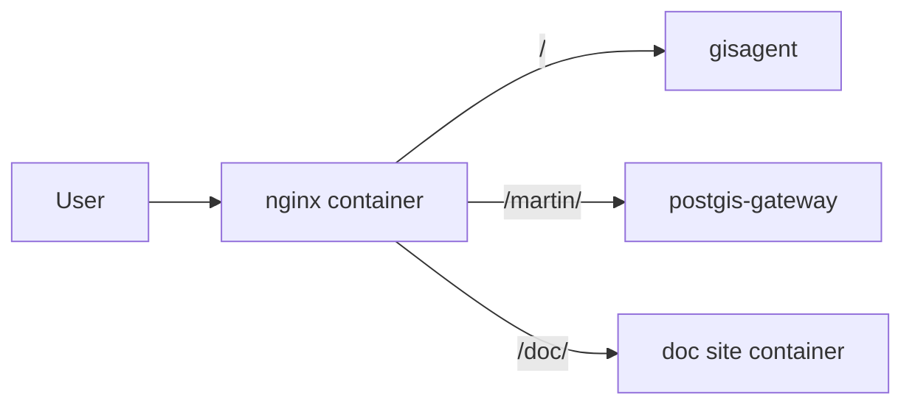

# 设计：`doc/` 文档站并入 Docker Compose 部署

## 摘要

本设计将当前“宿主机 `mint dev` + 本机 Nginx 临时代理”的方式，收敛为：

1. `doc/` 文档站由独立容器承载
2. 文档站与 `gisagent`、`postgis-gateway` 一样进入当前 Compose 体系
3. `/doc` 由仓库内 Nginx 容器正式代理

这不是恢复旧的远程服务耦合，而是把文档站作为一个独立 Web 服务纳入现有部署。

## 当前事实

### 1. 文档站已具备内容基础

`/home/maptex/Code/xcsmartdatabase/doc` 已包含：

- `docs.json`
- 多个 `.mdx` 页面
- `logo/`
- `favicon.svg`

因此当前缺的不是内容，而是部署形态。

### 2. 当前部署方式仍偏开发态

当前 `/doc` 访问依赖：

- 宿主机执行 `mint dev`
- Nginx 将 `/doc` 改写后代理到宿主机 `3000`

这个方案的主要问题是：

- 运维依赖人工启动
- 上游是开发服务器，不是正式容器服务
- 不利于复用现有的打包、部署、健康检查流程

### 3. 当前工程已有 Compose 主栈

根目录 `docker-compose.yml` 已经承载：

- `gisagent`
- `postgis-gateway`
- 多个 agent runtime
- 初始化同步服务

因此文档站的合理位置应是：

- 作为新的独立 service 并入当前主栈
- 而不是继续单独依赖宿主机进程

### 4. `docker-nginx-framework` 的可复用部分

`/home/maptex/Code/xcsmartdatabase/openspec/changes/docker-nginx-framework` 已沉淀了以下经验：

- 容器化 Nginx 的部署方式
- 对外统一使用域名入口
- 通过一个代理层分发到多个上游服务
- 健康检查、日志卷、网络连接等运行约束

本 change 复用这些经验，但不直接照搬“独立 Nginx 工程”这一组织方式。

## 目标拓扑

目标关系如下：

## 设计决策

### 1. 文档站作为独立容器

建议将 `doc/` 作为独立 Web 服务部署，而不是塞进已有业务容器。

原因：

- 文档站与 `gisagent` 运行职责不同
- 文档站变更频率与主站不同
- 独立容器更利于单独重建、回滚、健康检查

### 2. 部署优先使用静态产物或稳定预览服务

部署目标应从“开发预览”升级为“稳定服务”。推荐顺序：

1. 优先使用可构建的静态或生产 Web 服务镜像
2. 如 Mintlify 当前需要运行 Node 服务，也应在容器内启动，而不是依赖宿主机 CLI

设计约束：

- 不再以宿主机 `mint dev` 作为正式上游
- 不要求 `opencode` 或 agent 容器承担文档站运行

### 3. `/doc` 仍通过 Nginx 子路径暴露

入口保持：

- `https://server.maptex.top/doc/`
- `http://gisagent.smaryun.com/doc/`

Nginx 继续负责：

- `/doc` 到 `/doc/` 的规范化跳转
- `/doc/...` 到文档服务根路径的代理或静态服务映射
- 如仍需子路径改写，则在 Nginx 层统一处理

### 4. Nginx 以当前仓库配置为准

本 change 的长期目标是：

- 让仓库内 `nginx/` 配置成为正式部署依据
- 将当前“宿主机 `/home/maptex/docker/nginx/conf.d/main.conf` 手工改动”降级为历史过渡事实

这点与 `docker-nginx-framework` 一致，但边界更清晰：

- `docker-nginx-framework` 是历史方案输入
- 当前工程以根仓库 Compose 编排为中心

### 5. 网络与服务发现

延续现有 Compose 思路：

- Nginx 与 `gisagent`、`postgis-gateway`、文档站加入同一服务网络
- Nginx 通过服务名访问上游，而不是固定 IP
- 若采用变量 `proxy_pass`，继续保持动态 DNS 解析能力

## 建议实施形态

### 方案 A：在根 Compose 中新增 `doc-site` 服务

建议作为默认方案。

特点：

- 统一部署入口
- 与现有主栈一起启动和检查
- 更符合当前工程的整体运维路径

可能涉及：

- `doc/Dockerfile`
- 根目录 `docker-compose.yml`
- `nginx/nginx/gisagent.conf`

### 方案 B：保留独立 Nginx 工程但纳入主文档

仅作为兼容过渡方案。

特点：

- 可复用 `docker-nginx-framework` 的分发产物
- 但会维持“双 Compose / 双入口认知”

因此不建议作为长期主方案。

## 非目标

- 不将文档站与 GIS 业务运行时混合
- 不把 `doc/` 发布逻辑迁回宿主机脚本长期维持
- 不恢复对旧 `xcsmartdatabase-service` 的依赖

## 验收边界

实施完成后，至少应覆盖：

1. `docker compose up -d` 后文档站容器可健康运行
2. `/doc/` 首页返回 `200`
3. `/doc/<page>` 页面返回 `200`
4. `/doc` 返回规范化跳转
5. 文档静态资源在 `/doc` 子路径下可正确加载

公网 DNS、HTTPS 证书和云侧入口同步仍需单独验收。
